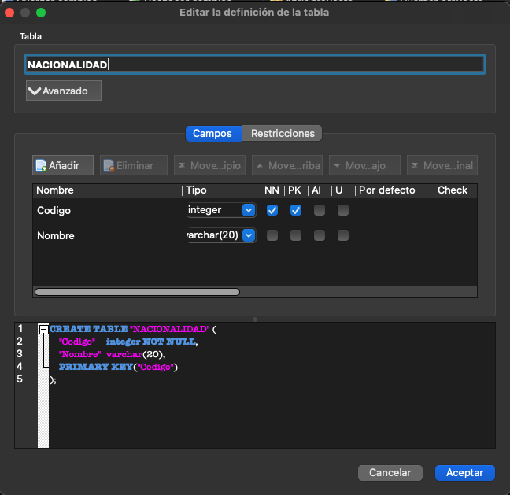

# Trabaja con una base de datos local

Si quieres trabajar offline con la base de datos, sigue los pasos que te pongo a continuación:

1. Instala [SQLite](https://www.sqlite.org/download.html) (es una biblioteca en lenguaje C que implementa un motor de base de datos SQL pequeño, rápido, autónomo, de alta fiabilidad y con todas las funciones).

2. Instala [DB Browser for SQLite](https://sqlitebrowser.org/dl/)

3. Una vez tengas todo instalado, descarga el fichero <a href="https://github.com/Andresblz/DBDD-USAL/blob/main/Crea%20una%20base%20de%20datos%20local%20(Explicacio%CC%81n)/data.db" download>data.db</a> y abre la base de datos desde [DB Browser for SQLite](https://sqlitebrowser.org/dl/) o copia el código [DBParaSQLite.sql](https://github.com/Andresblz/DBDD-USAL/blob/main/Crea%20una%20base%20de%20datos%20local%20(Explicacio%CC%81n)/DBParaSQLite.sql) y pégalo en el apartado _'Ejecutar SQL'_ de [DB Browser for SQLite](https://sqlitebrowser.org/dl/)

## ¿Qué ofrece DB Browser for SQLite?

DB Browser for SQLite ofrece una interfaz muy intuitiva, desde donde podremos crear nuevas bases de datos o gestionar las ya existentes.

Al mismo tiempo nos ofrece una _Hoja de datos_, dónde podremos ver los datos que hay en cada tabla, filtrar, añadir, eliminar, etc.

Y también cuenta con un apartado para _Ejecutar SQL_.

## Importante

Es importante leer la [documentación de SQLite](https://www.sqlite.org/docs.html), pero el cambio más destacable es en el uso de [dates](https://www.sqlite.org/lang_datefunc.html), pues la ejecución del código SQL varía en este apartado.

## Otras alternativas a SQLite y DB Browser for SQLite

Existen alternativas de uso gratuito (no comercial) como puede ser [SQL Server](https://www.microsoft.com/es-es/sql-server/sql-server-downloads), cabe destacar que en este caso se utiliza [Transact-SQL](https://learn.microsoft.com/es-es/sql/t-sql/language-reference?view=sql-server-ver16) y varía también en algunos aspectos como SQLite.

---

